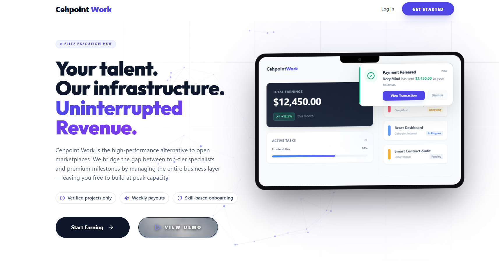

<div align="center">
  

  # 🌐 Cehpoint Work: Immersive Specialist Platform
  **Elite Execution Hub for the Top 1% of Global Talent**

  [](https://nextjs.org/)
  [](https://tailwindcss.com/)
  [](https://firebase.google.com/)
  [](https://www.framer.com/motion/)

  ---
  
  *Contributed by* **Sartak Roy**
</div>

---

## 🚀 Overview

Welcome to the **Cehpoint Work** Command Center. This is a high-fidelity, production-grade ecosystem designed for elite specialists to manage missions, track professional growth, and secure transparent payouts. Built with a "Interaction First" philosophy, it offers a seamless blend of performance and aesthetics.

## ✨ Key Features

- **🎯 Precision Task Management**: Real-time mission tracking with automated status updates.
- **💎 Premium UI/UX**: Immersive 3D backgrounds via Three.js and fluid animations powered by Framer Motion.
- **🛡️ Secure Payouts**: Integrated escrow-style payment tracking with weekly liquidity cycles.
- **📈 Professional Growth**: Domain-specific competency tests and skill-based project tiering.
- **🖥️ Desktop Optimized**: A workstation-first interface designed for high-productivity environments.

---

## 🛠️ Technology Stack

| Layer | Technology | Purpose |
| :--- | :--- | :--- |
| **Frontend** | Next.js 15 (App & Pages Router) | Core application framework |
| **Styling** | Tailwind CSS + Framer Motion | Dynamic, micro-animated responsive UI |
| **Backend** | Firebase (Auth, Firestore, Storage) | Real-time data sync and secure storage |
| **Visuals** | Three.js + Lucide Icons | 3D background elements and premium iconography |
| **AI Integration** | Google Gemini API | Automated task description and metadata generation |

---

## 🚀 "Model-Ready" Quick Start

### 📋 Prerequisites
- **Node.js**: v20 or higher
- **Firebase**: A project with Auth, Firestore, and Storage enabled

### 🔧 Environment Setup
Create a `.env.local` in the root:
```env
NEXT_PUBLIC_FIREBASE_API_KEY=your_key
NEXT_PUBLIC_FIREBASE_AUTH_DOMAIN=your_domain
NEXT_PUBLIC_FIREBASE_PROJECT_ID=your_id
NEXT_PUBLIC_FIREBASE_STORAGE_BUCKET=your_bucket
NEXT_PUBLIC_FIREBASE_MESSAGING_SENDER_ID=your_sender_id
NEXT_PUBLIC_FIREBASE_APP_ID=your_app_id
```

### ⚡ Installation & Boot
```bash
# Install high-fidelity dependencies
npm install

# Launch the Command Center (Local Dev)
npm run dev
```

---

## 🏗️ Project Philosophy

**Cehpoint Work** is built on the principle of **Interaction First**. 
- Every transition is mathematically smoothed by **Framer Motion**.
- The onboarding experience uses **WebGL (Three.js)** for ultra-premium immersion.
- The design system follows a **"Command Center"** aesthetic: dark, high-contrast, and deeply informative.

---

## 📚 Documentation Hub

1.  [**🛠️ Tech Stack & Dependencies**](./docs/TECH_STACK.md): Detailed mapping of architecture.
2.  [**🌊 System Flow & State**](./docs/SYSTEM_FLOW.md): End-to-end lifecycle of tasks and users.
3.  [**🗺️ AI-Model Handover Map**](./docs/AI_DEVELOPER_MAP.md): A topological guide for AI developers.

---

## 🛡️ Maintainer Integrity
This repository is optimized for **Clarity and Extensibility**. All business logic is centralized in `/utils/storage.ts` to ensure data integrity can be audited with zero friction.

<div align="center">
  <br />
  <p><i>Built with precision by Cehpoint Systems. Optimized for the future of work.</i></p>
</div>
